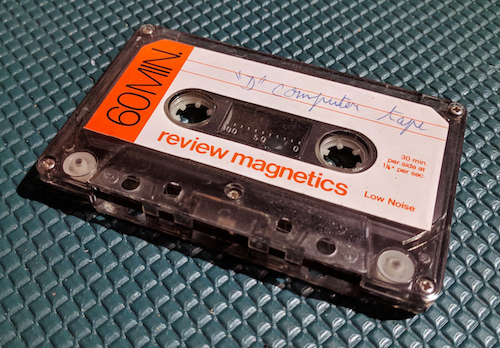
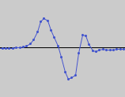
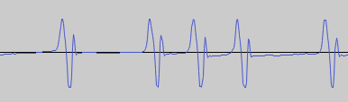
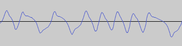

This is a Java program that reads WAV files of low-speed (500 baud) and
high-speed (1500 baud) TRS-80 Model I and Model III cassettes
and generates a clean high-speed version that can be
read by an [emulator](https://github.com/lkesteloot/trs80).

The WAV file must be mono, 44.1 kHz, little-endian, and 16 bits per sample. The
input is a single WAV file for the entire cassette (both sides). The output is
a sequence of files, three for each recording on the cassette: a generated
high-speed WAV file (`.wav`); a binary file containing the raw bits (`.bin`);
and a text program containing the decoded Basic program (`.bas`).

# Running

Run with:

    % ./gradlew run --args "INPUT_PATHNAME OUTPUT_PREFIX"

For example:

    % ./gradlew run --args "M-2.wav M-2-"

# Filename convention

I use this convention for audio files of data cassettes:

    NAME-TAKE-TRACK-COPY.wav

where:

* `NAME`: The name of the cassette, as written on it. Remove side number if
  present, recoding the whole cassette as a single audio file. Rename cassettes
  (by writing on them) if there are conflicts.
* `TAKE`: Which recording, starting with 1. Sometimes I record a cassette
  multiple times with different equipment. The output of this clean-up program
  counts as a new take (for example, the digitized version is `L-1` and the cleaned
  up version is `L-2`).
* `TRACK`: Which track, starting with 1, continuing on to second side. If
  multiple copies of a program are saved, they all count as one track.
* `COPY`: Which copy, starting with 1. Often with these computers we'd
  save a program more than once in a row, in case the first one got
  damaged.

You can leave off `TRACK` or `COPY` from the end to mean "all". For example:

* `L-2` is the second take of the `L` cassette.
* `L-2-3` is the third track of that take. This might consist of multiple
  copies of the same program.
* `L-2-3-1` is the first copy of that track.

The program treats two recordings that are more than 10 seconds apart as different
tracks.

# 500 baud (low-speed) encoding

The TRS-80 Model I level 2 low-speed (500 baud) encoding is as follows:

* Each bit takes 2 ms (500 Hz), regardless of value.
* A "pulse" in this encoding is a single sine wave cycle lasting about 400 µs,
  or 18 samples at 44.1 kHz. There are about 7 samples between the top of the
  cycle and the bottom of it, for a total cycle period of about 14 samples, 317
  µs, or about 3150 Hz. The remaining 4 samples are a small bump above zero.

* A 0 bit is encoded as one pulse at the end of its 2 ms period.
* A 1 bit is encoded as two 1 ms periods, each ending in a pulse.
* Both values therefore end in a pulse, but the 1 value has an extra
  pulse in the middle.
* Each byte is written with its most-significant bit first.
* The header is about 2000 zero bits followed by the value 0xA5.
* In some recordings the length of the zero bits in the header can increase
  smoothly from 0.7 ms to 2 ms.
* The program is then written as a sequence of bytes.
* Between the header and the program is a 1 ms pause. This is probably not intentional,
  but a result of some processing the ROM had to do when writing the program. The pause
  is between the first and second pulse of the least significant bit of the
  header-terminating value 0xA5.
* A 100 ms silence indicates the end of the program. There's no special end-of-file marker.
* The above description is for level 2 encoding. There's also an older level 1 encoding.
  I believe it's the same with all the times doubled, but I've never seen it myself.

This sample encodes two 0 bits, one 1 bit, then one 0 bit:

# 1500 baud (high-speed) encoding

The TRS-80 Model III high-speed (1500 baud) encoding is as follows:

* Each bit is one cycle of a sine wave (positive half-cycle, then negative
  half-cycle).
* A 0 bit is encoded as a full cycle taking 725 µs, or 32 samples at 44.1 kHz.
* A 1 bit is encoded as a full cycle taking 340 µs, or 15 samples at 44.1 kHz.
* Each byte is written with its most-significant bit first.
* The header is 256 instances of the byte 0x55, followed by a single 0x7F.
* The program is then written as a sequence of bytes, each starting with a
  start bit of value 0 followed by the byte value.
* Between the header and the program is a 1 ms pause. This is probably not intentional,
  but a result of some processing the ROM had to do when writing the program.
* A 1.5 ms silence indicates the end of the program. There's no special end-of-file marker.

This sample encodes one 1 bit, two 0 bits, four 1 bits, and one 0 bit:

# 1500 baud mystery

Note that in the high-speed encoding a 0 bit is about twice as long as a 1 bit.
This is a strange design, since 0 bits appear far more often in programs: all
space characters (0x20) have 0 for 7 of their 8 bits; all ASCII characters
(comments, strings) have their most significant bit as 0; every start bit is a
zero.

In one program I analyzed, there were 15,472 zero bits and 2960 one bits. That's
a recording time of 12.2 seconds, or 1508 baud. Had they swapped the meaning of
the two cycle times, that would have been reduced to 7.4 seconds, or 2489 baud.
Instead of a jump from 500 baud (on the Model I) to 1500 baud, they could have
claimed nearly 2500 baud! If anyone knows why they made this decision, please
let me know.

# Basic decoding

In order to save space and speed up execution, Basic programs in memory and on
cassette are stored with each Basic token replaced by a single byte. For example,
the `PRINT` token is saved as byte 0xB2. When the user enters a new line of
Basic code, the tokens are replaced by their single-byte version, and the reverse
is done when listing the program.

The `Basic.java` source file converts the tokenized version back to text and
saves the program with a `.bas` extension. Basic programs on cassette have the
following format:

* The three bytes 0xD3 0xD3 0xD3.
* A single byte for the name of the program. This is the name specified
  in the `CSAVE` command.
* For each line in the program:
  * Two little-endian bytes for the memory address of the next line in
    the program. This is useful in memory when zipping through the program.
    Two zero bytes indicate the end of the program. The values stored
    on cassette are ignored and regenerated when loaded.
  * Two little-endian bytes for the line number.
  * The code itself.

There's one tricky bit about the decoding. There are two ways to write
comments. One is the `REM` keyword, which starts a statement:

    20 INPUT N$:REM Get the name of the user.

The second is the single quote, which needn't start a new statement:

    20 INPUT N$ ' Get the name of the user.

To make this easier to execute, they used a trick for saving the single quote
comment character. They internally replaced the single quote with this
three-byte sequence:

* A statement-separating colon `:`.
* The token for `REM` (0x93).
* A special token for the single quote comment (0xFB).

When listed, these three bytes were displayed as a single quote. When executed,
they looked like an old-style `REM` statement. This line:

    20 INPUT N$ ' Get the name of the user.

appeared this way to the interpreter:

    20 INPUT N$ :REM* Get the name of the user.

where the `*` above is actually the 0xFB character, ignored since it's
inside a comment.

